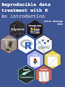

```{r, echo = FALSE, message = FALSE}
knitr::opts_chunk$set(
  fig.align = 'center',
  collapse = TRUE,
  comment = "#>",
  fig.path = "man/figures/README-")
```

# tutor 

<br>
<br>

# Description

This package is a gathering of various interactive exercises for the "[Reproducible data treatment with R](https://colinbousige.github.io/rclass/)" class.

It also contains some user-defined functions that are used in the class.

# Installation

First, install the packages `devtools`, `learnr` and `gradethis` if you don't have them yet:

```r
install.packages("devtools")
devtools::install_github("rstudio/learnr", force = TRUE)
devtools::install_github("rstudio/gradethis", force = TRUE)
```

Then run the following to install the `tutor` package:

```r
devtools::install_github("colinbousige/tutor")
```

It is also recommended to install the following package, as we will use it heavily in the exercises:

```r
install.packages("tidyverse")
```

# Usage

## Tutorials

After having installed the package, launch a tutorial by running:

```r
library(tutor)
tuto() # prints the list of available tutorials
tuto("tutorial_name")
```

In this call, `"tutorial_name"` can be any of:

- `"variables"`
- `"vectors"`
- `"dataframes"`
- `"plots"`
- `"fits"`

## Example Files

The `tutor` package also come bundled with some example files. A complete list can be accessed with:

```r
tutor_example()
tutor_example(pattern = "csv") # apply a regex filter
# To read a file, for example:
read.csv(tutor_example("CO2_emission.csv"))
```
